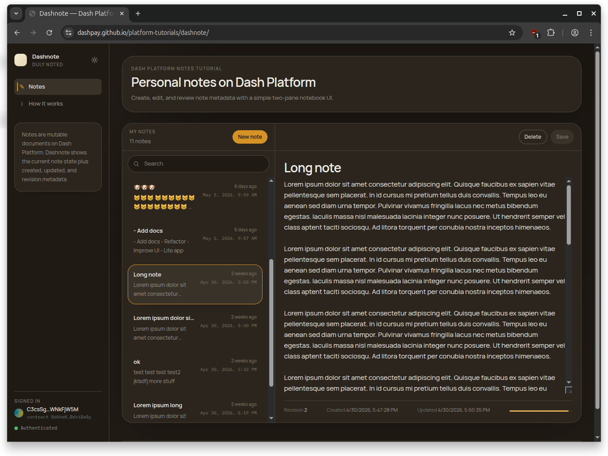

```{eval-rst}
.. _tutorials-example-apps-dashnote:
```

# Dashnote

[Dashnote](https://dashpay.github.io/platform-tutorials/dashnote/) is a React + TypeScript + Vite single-page app that demonstrates full mutable-document CRUD on Dash Platform. Users log in with a BIP-39 mnemonic, create notes with an optional title and required message body, edit and delete their own notes, and browse any identity's notes in read-only mode without credentials.

```{button-link} https://dashpay.github.io/platform-tutorials/dashnote/
:color: primary
:shadow:

Try Dashnote live
```

Where [DashMint Lab](dashmint-lab.md) covers the NFT-shaped operations (mint, transfer, price, purchase, burn), Dashnote covers the everyday document lifecycle: create, query, update, delete — plus the **fetch-then-bump-revision** pattern that every Platform document update has to follow.



## What this app does

The app ships with a bundled note contract so the read path works on a fresh install without registering anything. After login, users can create notes (optional `title`, required `message`), edit them in place, and delete them. The editor reports field length in **UTF-8 bytes** rather than characters, because that's what Platform's `maxLength` constraint actually checks. A localStorage-backed cache paints the recent-notes list instantly on reload while a background query revalidates against the network.

For background on data contracts and document state transitions, see [Submit documents](../contracts-and-documents/submit-documents.md), [Update documents](../contracts-and-documents/update-documents.md), and [Delete documents](../contracts-and-documents/delete-documents.md).

## How the code is structured

Every Platform SDK call lives in its own file under `src/dash/`. The React UI is a thin layer on top that wires those functions to forms and buttons. Like DashMint, Dashnote imports the same `setupDashClient-core.mjs` module covered in [Setup SDK Client](../setup-sdk-client.md), so the Node tutorials and this app share one source of truth for client creation and key derivation.

## TL;DR

- Each note operation lives in its own `src/dash/*.ts` file.
- The easiest entry points are `src/dash/queries.ts`, `src/dash/createNote.ts`, and `src/dash/updateNote.ts`.
- The central pattern is **fetch → bump revision → replace** in `updateNote.ts`.
- `client.ts` and `keyManager.ts` are thin re-exports of `setupDashClient-core.mjs`.

If you just want the mental model: read the architecture table, then `createNote.ts`, then `updateNote.ts` to see how revision bumping works.

## Prerequisites

- [General prerequisites](../introduction.md#prerequisites) (Node.js / Dash SDK installed)
- A configured client: [Setup SDK Client](../setup-sdk-client.md) — Dashnote re-uses `setupDashClient-core.mjs`
- A registered identity: [Register an Identity](../identities-and-names/register-an-identity.md)
- Familiarity with data contracts: [Register a Data Contract](../contracts-and-documents/register-a-data-contract.md)
- Node >= 22 and a funded testnet identity (BIP-39 mnemonic + identity index) for write operations
- Read-only browse works without any credentials against the bundled default contract

## Clone and run

```bash
git clone https://github.com/dashpay/platform-tutorials.git
cd platform-tutorials/example-apps/dashnote
npm install
npm run dev
```

The dev server runs on `http://localhost:5173`. Open it in a browser to browse notes in read-only mode immediately, or click **Login** and paste your testnet mnemonic to start creating and editing notes.

Production build: `npm run build && npm run preview`.

## Architecture tour

Every Platform SDK call lives in its own file under `src/dash/`:

| Operation | File | SDK method |
| --------- | ---- | ---------- |
| Connect to testnet | `src/dash/client.ts` | `EvoSDK.testnetTrusted()` + `sdk.connect()` |
| Derive identity keys | `src/dash/keyManager.ts` | `wallet.deriveKeyFromSeedWithPath` |
| Register note contract | `src/dash/contract.ts` | `sdk.contracts.publish` |
| Create a note | `src/dash/createNote.ts` | `sdk.documents.create` |
| Update a note | `src/dash/updateNote.ts` | `sdk.documents.get` + `sdk.documents.replace` |
| Delete a note | `src/dash/deleteNote.ts` | `sdk.documents.delete` |
| List notes | `src/dash/queries.ts` | `sdk.documents.query` |
| Get one note | `src/dash/queries.ts` | `sdk.documents.get` |

Three supporting files glue the operations together:

- `src/dash/types.ts` — shared SDK types (`DashSdk`, `DashKeyManager`, query result shapes) wired through every dash helper.
- `src/lib/logger.ts` — `Logger` function type plus `errorMessage(err)`. Plumbed through every dash call so progress streams to the activity log; `level: "success" | "error"` raises sonner toasts.
- `src/lib/notesCache.ts` — localStorage-backed note list keyed by `identityId + contractId + network`. Powers optimistic paint on reload before background revalidation completes.

`client.ts` and `keyManager.ts` are just re-exports:

```typescript
export { createClient } from '../../../../setupDashClient-core.mjs';
export { IdentityKeyManager } from '../../../../setupDashClient-core.mjs';
```

That means the connection and key-derivation behavior are the same as in the Node tutorials. Read [Setup SDK Client](../setup-sdk-client.md) for the full client setup details.

## The update pattern

Every update on an existing Platform document follows the same three steps:

1. Fetch the current on-chain document so you can read its revision.
2. Set `revision = BigInt(existing.revision ?? 0) + 1n`. Platform rejects state transitions that don't strictly increase the revision.
3. Call `sdk.documents.replace` with the new document body and the bumped revision.

This is why every Platform UI that lets users edit content needs to fetch before writing — there is no blind update. Dashnote's `updateNote.ts` is the canonical example, walked through in [Update a note](#update-a-note) below.

## Read path: queries first

If you want to understand how data shows up in the UI, start with `src/dash/queries.ts`. The recent-notes list uses `sdk.documents.query` with the `byOwnerUpdated` index, then sorts the results client-side by `$updatedAt` descending so the most recently edited note appears first. `normalizeNotes()` flattens the three possible shapes the SDK can return (array, `Map`, or plain object) into a flat list of `NoteRecord` values the UI can render.

`getNote()` is the single-document fetch used by the editor pane and by [Dashnote Lite's](dashnote-lite.md) "Get by ID" tab.

```{code-block} typescript
:caption: queries.ts
:name: dashnote-queries.ts

/**
 * Read-side queries against the note contract.
 *
 * SDK methods:
 *   sdk.documents.query({ dataContractId, documentTypeName, where, orderBy, limit })
 *   sdk.documents.get(contractId, documentTypeName, documentId)
 */
import type { Logger } from "../lib/logger";
import type {
  DashDocumentLike,
  DashNoteQueryDocument,
  DashNoteQueryJson,
  DashNoteQueryResults,
  DashSdk,
} from "./types";

const MAX_QUERY_LIMIT = 100;

export interface NoteRecord {
  id: string;
  ownerId: string;
  title: string | null;
  message: string;
  createdAt: number | null;
  updatedAt: number | null;
  revision: number;
}

function toTimestamp(
  value: DashNoteQueryJson["$createdAt"] | DashNoteQueryJson["$updatedAt"],
): number | null {
  if (typeof value === "number" && Number.isFinite(value)) return value;
  if (typeof value === "bigint") return Number(value);
  if (typeof value === "string" && value) {
    const parsed = Number(value);
    return Number.isFinite(parsed) ? parsed : null;
  }
  return null;
}

function toRevision(
  value: number | string | bigint | undefined,
  fallback?: number | string | bigint,
): number {
  const raw = value ?? fallback;
  if (typeof raw === "number" && Number.isFinite(raw)) return raw;
  if (typeof raw === "bigint") return Number(raw);
  if (typeof raw === "string" && raw) {
    const parsed = Number(raw);
    return Number.isFinite(parsed) ? parsed : 0;
  }
  return 0;
}

function toNote(id: string | null, raw: DashNoteQueryDocument): NoteRecord {
  const json: DashNoteQueryJson =
    typeof raw?.toJSON === "function" ? raw.toJSON() : raw;
  return {
    id: String(id ?? json.$id ?? json.id ?? ""),
    ownerId: String(json.$ownerId ?? ""),
    title: typeof json.title === "string" ? json.title : null,
    message: typeof json.message === "string" ? json.message : "",
    createdAt: toTimestamp(json.$createdAt),
    updatedAt: toTimestamp(json.$updatedAt),
    revision: toRevision(json.$revision, raw.revision),
  };
}

export function normalizeNotes(results: DashNoteQueryResults): NoteRecord[] {
  if (Array.isArray(results)) {
    return results
      .filter(Boolean)
      .map((doc) => toNote(null, doc as DashNoteQueryDocument));
  }
  const entries =
    results instanceof Map ? Object.fromEntries(results) : results;
  return Object.entries(entries)
    .filter(([, doc]) => Boolean(doc))
    .map(([id, doc]) => toNote(id, doc as DashNoteQueryDocument));
}

export function normalizeSingleNote(
  id: string,
  raw: DashDocumentLike | undefined,
): NoteRecord | null {
  if (!raw) return null;
  return toNote(id, raw as DashNoteQueryDocument);
}

export async function listMyNotes({
  sdk,
  contractId,
  ownerId,
  limit = MAX_QUERY_LIMIT,
  log,
}: {
  sdk: DashSdk;
  contractId: string;
  ownerId: string;
  limit?: number;
  log?: Logger;
}): Promise<NoteRecord[]> {
  log?.("Loading your notes…");
  const results = await sdk.documents.query({
    dataContractId: contractId,
    documentTypeName: "note",
    where: [["$ownerId", "==", ownerId]],
    orderBy: [
      ["$ownerId", "asc"],
      ["$updatedAt", "asc"],
    ],
    limit,
  });

  return normalizeNotes(results).sort(
    (left, right) => (right.updatedAt ?? 0) - (left.updatedAt ?? 0),
  );
}

export async function getNote({
  sdk,
  contractId,
  noteId,
  log,
}: {
  sdk: DashSdk;
  contractId: string;
  noteId: string;
  log?: Logger;
}): Promise<NoteRecord | null> {
  log?.(`Loading note ${noteId}…`);
  const result = await sdk.documents.get(contractId, "note", noteId);
  return normalizeSingleNote(noteId, result);
}
```

## Operation walkthrough

Each operation file is intentionally small. The app-level pattern is: validate input, build a `Document` (and fetch the existing one when updating), call one SDK method, then log the result.

### Create a note

`createNote.ts` is the simplest write in the app: build a new `Document`, hand it to `sdk.documents.create`, and pull the new note's ID off the returned document. The contract requires `message`; `title` is optional and only included when non-empty after trimming.

```{code-block} typescript
:caption: createNote.ts
:name: dashnote-createNote.ts

/**
 * Create a new note document.
 *
 * SDK method: sdk.documents.create({ document, identityKey, signer })
 */
import type { Logger } from "../lib/logger";
import { PLATFORM_VERSION_OVERRIDE } from "../../../../platformVersion.mjs";
import { loadSdkModule } from "./sdkModule";
import type { DashKeyManager, DashSdk } from "./types";

export interface CreateNoteParams {
  sdk: DashSdk;
  keyManager: DashKeyManager;
  contractId: string;
  title?: string;
  message: string;
  log?: Logger;
}

export async function createNote({
  sdk,
  keyManager,
  contractId,
  title,
  message,
  log,
}: CreateNoteParams): Promise<string> {
  log?.("Creating note…");
  const { identity, identityKey, signer } = await keyManager.getAuth();
  const { Document } = await loadSdkModule();
  const trimmedTitle = title?.trim();
  const document = new Document({
    properties: {
      ...(trimmedTitle ? { title: trimmedTitle } : {}),
      message,
    },
    documentTypeName: "note",
    dataContractId: contractId,
    ownerId: identity.id,
  });

  await sdk.documents.create({
    document,
    identityKey,
    signer,
  });

  const json =
    typeof document.toJSON === "function"
      ? (document.toJSON(PLATFORM_VERSION_OVERRIDE) as Record<string, unknown>)
      : {};
  const noteId = String(json.$id ?? json.id ?? "");
  if (!noteId) {
    throw new Error("Created note returned no ID.");
  }
  log?.("Note created.", "success");
  return noteId;
}
```

### Update a note

`updateNote.ts` is the canonical fetch-then-bump-revision write:

- Call `sdk.documents.get` to read the current on-chain revision.
- Increment it by one and build a new `Document` with the same id and ownerId.
- Submit via `sdk.documents.replace`. Replays without bumping the revision are rejected by the state transition.

The optional `expectedRevision` parameter guards against a concurrent edit: if the on-chain revision no longer matches what the caller last loaded, the update is refused with a "reload and try again" error instead of silently overwriting the newer version.

```{code-block} typescript
:caption: updateNote.ts
:name: dashnote-updateNote.ts

/**
 * Update an existing note. Fetches the current document to bump its revision,
 * then submits a replace state transition.
 *
 * Pass `expectedRevision` to refuse the update if the network's revision
 * doesn't match — i.e. the note was changed on the network after the local
 * copy was loaded.
 *
 * SDK methods:
 *   sdk.documents.get(contractId, documentTypeName, documentId)
 *   sdk.documents.replace({ document, identityKey, signer })
 */
import type { Logger } from "../lib/logger";
import { loadSdkModule } from "./sdkModule";
import type { DashKeyManager, DashSdk } from "./types";

export interface UpdateNoteParams {
  sdk: DashSdk;
  keyManager: DashKeyManager;
  contractId: string;
  noteId: string;
  title?: string;
  message: string;
  expectedRevision?: number;
  log?: Logger;
}

export async function updateNote({
  sdk,
  keyManager,
  contractId,
  noteId,
  title,
  message,
  expectedRevision,
  log,
}: UpdateNoteParams): Promise<bigint> {
  log?.(`Saving note ${noteId}…`);
  const { identity, identityKey, signer } = await keyManager.getAuth();
  const existingDoc = await sdk.documents.get(contractId, "note", noteId);
  if (!existingDoc) {
    throw new Error(`Note ${noteId} not found.`);
  }

  const currentRevision = BigInt(existingDoc.revision ?? 0);
  if (
    expectedRevision !== undefined &&
    currentRevision !== BigInt(expectedRevision)
  ) {
    throw new Error(
      `Note changed on network (you had revision ${expectedRevision}, network is at ${currentRevision}). Reload your notes and try again.`,
    );
  }

  const { Document } = await loadSdkModule();
  const revision = currentRevision + 1n;
  const trimmedTitle = title?.trim();
  const document = new Document({
    properties: {
      ...(trimmedTitle ? { title: trimmedTitle } : {}),
      message,
    },
    documentTypeName: "note",
    dataContractId: contractId,
    ownerId: identity.id,
    revision,
    id: noteId,
  });

  await sdk.documents.replace({
    document,
    identityKey,
    signer,
  });
  log?.("Note saved.", "success");
  return revision;
}
```

### Delete a note

`deleteNote.ts` is the inverse of create — no fetch needed. `sdk.documents.delete` only needs enough identifying fields (id, ownerId, dataContractId, documentTypeName), not a full document, so we can skip the round-trip.

```{code-block} typescript
:caption: deleteNote.ts
:name: dashnote-deleteNote.ts

/**
 * Delete a note document.
 *
 * SDK method: sdk.documents.delete({ document, identityKey, signer })
 */
import type { Logger } from "../lib/logger";
import type { DashKeyManager, DashSdk } from "./types";

export interface DeleteNoteParams {
  sdk: DashSdk;
  keyManager: DashKeyManager;
  contractId: string;
  noteId: string;
  log?: Logger;
}

export async function deleteNote({
  sdk,
  keyManager,
  contractId,
  noteId,
  log,
}: DeleteNoteParams): Promise<void> {
  log?.(`Deleting note ${noteId}…`);
  const { identity, identityKey, signer } = await keyManager.getAuth();
  await sdk.documents.delete({
    document: {
      id: noteId,
      ownerId: identity.id,
      dataContractId: contractId,
      documentTypeName: "note",
    },
    identityKey,
    signer,
  });
  log?.("Note deleted.", "success");
}
```

## Contract schema

The note contract is intentionally minimal: one document type, two user-editable fields, two indices to support the recent-notes list. Key choices worth calling out:

- `documentsMutable: true` and `canBeDeleted: true` — notes are editable and deletable.
- `maxLength: 120` for `title` caps the title; `message` carries no `maxLength` and is instead bounded by Platform's per-field byte limit. The editor's progress bar tracks the `message` byte count against that limit — emoji and non-ASCII sequences consume more of the budget than ASCII.
- `byOwnerUpdated` (`$ownerId`, `$updatedAt`) is the index the recent-notes list paginates on; `byOwnerCreated` is its created-time sibling.

`registerContract` builds the `DataContract`, calls `setConfig()` to lock in those choices, then publishes via `sdk.contracts.publish`. `ensureContract` is the lazy wrapper used by the login flow: re-use a saved contract ID if one is present, otherwise register a fresh one.

```{code-block} typescript
:caption: contract.ts
:name: dashnote-contract.ts

/**
 * Note data contract: schema definition + registration.
 *
 * SDK methods:
 *   sdk.contracts.publish({ dataContract, identityKey, signer })
 *   sdk.identities.nonce(identityId)
 */
import type { Logger } from "../lib/logger";
import { loadSdkModule } from "./sdkModule";
import type { DashKeyManager, DashSdk } from "./types";

export const NOTE_SCHEMAS = {
  note: {
    type: "object",
    documentsMutable: true,
    canBeDeleted: true,
    properties: {
      title: {
        type: "string",
        maxLength: 120,
        position: 0,
      },
      message: {
        type: "string",
        position: 1,
      },
    },
    required: ["$createdAt", "$updatedAt", "message"],
    additionalProperties: false,
    indices: [
      {
        name: "byOwnerUpdated",
        properties: [{ $ownerId: "asc" }, { $updatedAt: "asc" }],
      },
      {
        name: "byOwnerCreated",
        properties: [{ $ownerId: "asc" }, { $createdAt: "asc" }],
      },
    ],
  },
} as const;

const STORAGE_KEY = "dashnote.contractId";

/**
 * Default contract ID baked into the tutorial so the notebook UI works on a
 * fresh machine without registering a contract first. Users can override it
 * in Settings or register their own.
 */
export const DEFAULT_CONTRACT_ID =
  "8d6heK6CoskLBi6Rs7cChRG9RuckcZqZst28BdviBe8y";

export function loadStoredContractId(): string | null {
  try {
    return localStorage.getItem(STORAGE_KEY) ?? DEFAULT_CONTRACT_ID;
  } catch {
    return DEFAULT_CONTRACT_ID;
  }
}

export function saveContractId(id: string): void {
  localStorage.setItem(STORAGE_KEY, id);
}

export function clearStoredContractId(): void {
  localStorage.removeItem(STORAGE_KEY);
}

export async function refreshContractCache({
  sdk,
  contractId,
}: {
  sdk: DashSdk;
  contractId: string;
}): Promise<void> {
  if (!contractId || typeof sdk.getWasmSdkConnected !== "function") return;
  const wasm = await sdk.getWasmSdkConnected();
  if (!wasm || typeof wasm.removeCachedContract !== "function") return;
  const { Identifier } = await loadSdkModule();
  const identifier = new Identifier(contractId);
  try {
    wasm.removeCachedContract(identifier);
  } finally {
    identifier.free?.();
  }
}

export async function registerContract({
  sdk,
  keyManager,
  log,
}: {
  sdk: DashSdk;
  keyManager: DashKeyManager;
  log?: Logger;
}): Promise<string> {
  log?.("Registering Dashnote note contract…");
  const { identity, identityKey, signer } = await keyManager.getAuth();
  const identityNonce = await sdk.identities.nonce(identity.id.toString());
  const { DataContract } = await loadSdkModule();
  const dataContract = new DataContract({
    ownerId: identity.id,
    identityNonce: (identityNonce || 0n) + 1n,
    schemas: NOTE_SCHEMAS,
    fullValidation: true,
  });

  (
    dataContract as unknown as {
      setConfig: (config: Record<string, unknown>) => void;
    }
  ).setConfig({
    canBeDeleted: false,
    readonly: false,
    // Must stay false: keepsHistory: true triggers dashpay/platform#3165 —
    // sdk.contracts.fetch() returns undefined, breaking sdk.documents.query
    // with "Data contract not found".
    keepsHistory: false,
    documentsKeepHistoryContractDefault: false,
    documentsMutableContractDefault: true,
    documentsCanBeDeletedContractDefault: true,
  });

  const published = await sdk.contracts.publish({
    dataContract,
    identityKey,
    signer,
  });
  const contractId = published.id?.toString() || published.toJSON?.()?.id;
  if (!contractId) {
    throw new Error("Contract publish returned no ID.");
  }

  saveContractId(contractId);
  log?.(`Dashnote contract registered: ${contractId}`, "success");
  return contractId;
}

export async function ensureContract({
  sdk,
  keyManager,
  existingId,
  log,
}: {
  sdk: DashSdk;
  keyManager: DashKeyManager;
  existingId?: string | null;
  log?: Logger;
}): Promise<string> {
  const reused = existingId ?? loadStoredContractId();
  if (reused) {
    log?.(`Using saved contract ID: ${reused}`);
    return reused;
  }
  return registerContract({ sdk, keyManager, log });
}
```

## Notes cache and optimistic UI

`src/lib/notesCache.ts` stores the most recent query result in `localStorage` keyed by `identityId + contractId + network`. On reload, the workspace paints from the cache immediately, then issues a background `listMyNotes` query and reconciles. Switching identity, contract, or network invalidates the cache because the key changes. Each cached payload includes a `SCHEMA_VERSION` field; entries written by older versions are ignored on read.

This pattern is generally useful for any UI built on `sdk.documents.query`: the queries themselves are not free, and users tolerate stale-then-fresh much better than blank-then-fresh.

## Next steps

- Try [Dashnote Lite](dashnote-lite.md) for a zero-build, single-file read-only version that runs the SDK straight from a CDN.
- Run the same operations headlessly from Node using the tutorials in [Contracts and documents](../contracts-and-documents.md).
- Fork the app and adapt the contract schema to your own document use case. The one-file-per-operation layout under `src/dash/` makes it easy to swap a single operation without touching the rest.
