# Terminal user interface (TUI)

The Dash Platform [Terminal User Interface (TUI)](https://github.com/dashpay/platform-tui) is a
Rust-based application for interacting with Dash Platform in the terminal. Its purpose is to enable
users to perform all actions permitted by Dash Platform, which, broadly speaking, means broadcasting
state transitions and querying the network. The repository can be [cloned from
GitHub](https://github.com/dashpay/platform-tui) and built according to the instructions found
there.

## Main screen

This screen is the application's main menu. The interface provides quick navigation options and a summary of essential information.

Click an option below to jump to the section describing it in more detail:

- [Identity management](#identity-management)
- [Name service (DPNS)](#name-service-dpns)
- [Contracts](#contracts)
- [Wallet](#wallet)
- [Platform information](#platform-information)
- [Strategies](#strategies)

## Identity management

This screen is where identity operations are done, including requesting identities, transferring credits, and registering [DPNS names](https://docs.dash.org/projects/platform/en/stable/docs/explanations/dpns.html). Press `p` to enable proofs.

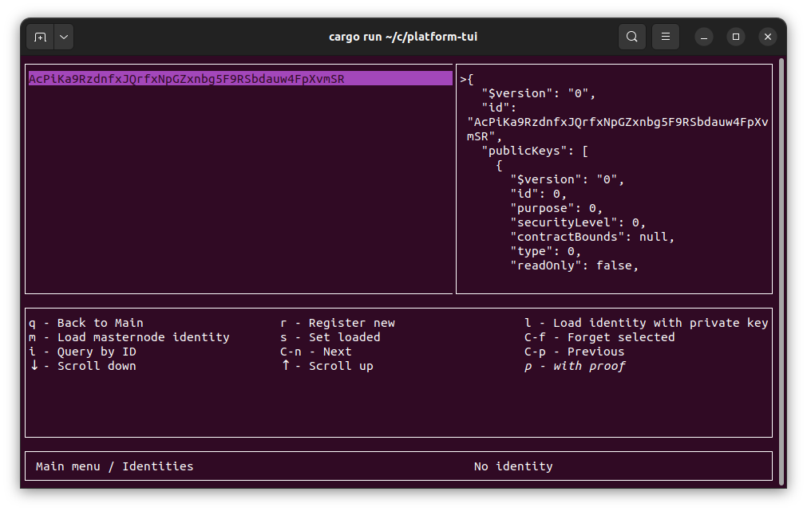

## Name Service (DPNS)

This screen view information related to your identities and any names linked to them. It also provides access to the voting screen where masternodes can vote on [requests for premium names](../../explanations/dpns.md#conflict-resolution).

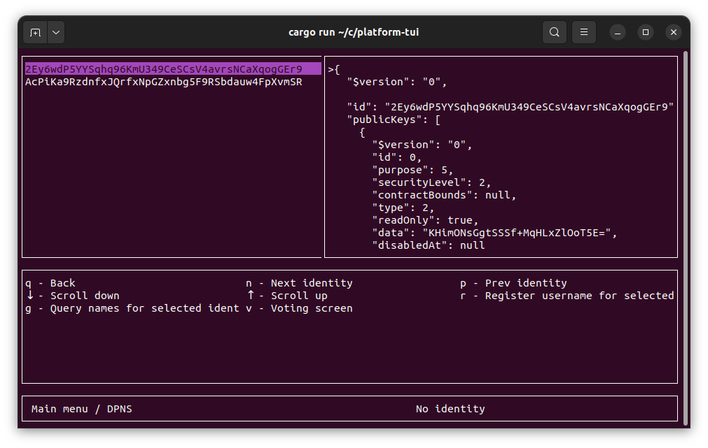

## Contracts

This screen is where you will add, manage and remove [contracts](https://docs.dash.org/projects/platform/en/stable/docs/tutorials/contracts-and-documents.html). System contracts encompass [Dashpay](https://docs.dash.org/projects/platform/en/stable/docs/explanations/dashpay.html) and [DPNS](https://docs.dash.org/projects/platform/en/stable/docs/explanations/dpns.html) contracts as of today, other contracts must be fetched by ID.

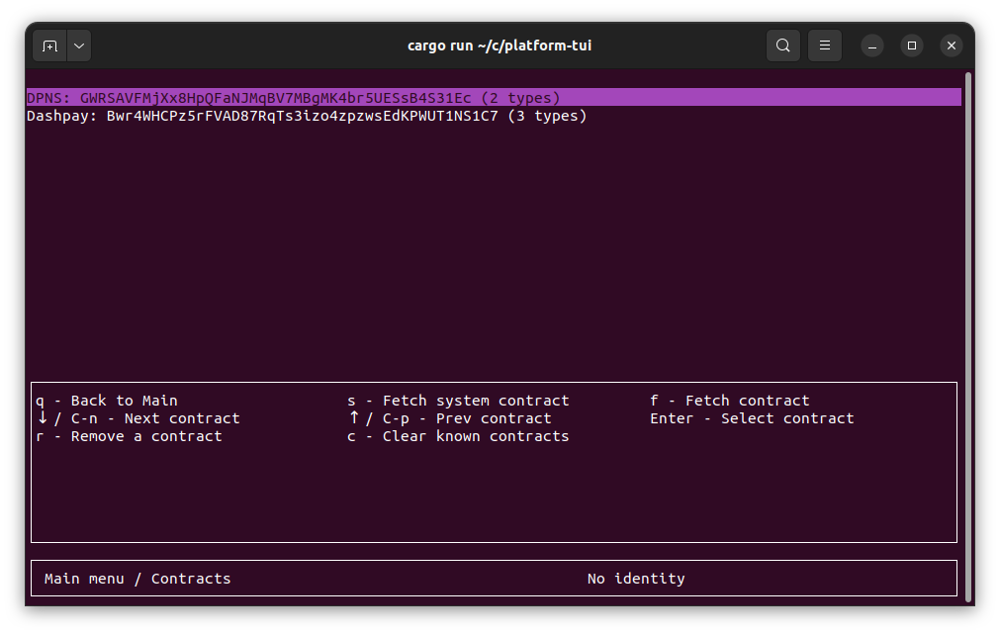

## Wallet

This screen lets you see a loaded wallet's information, including wallet type, public key, address, balance and number of UTXOs.

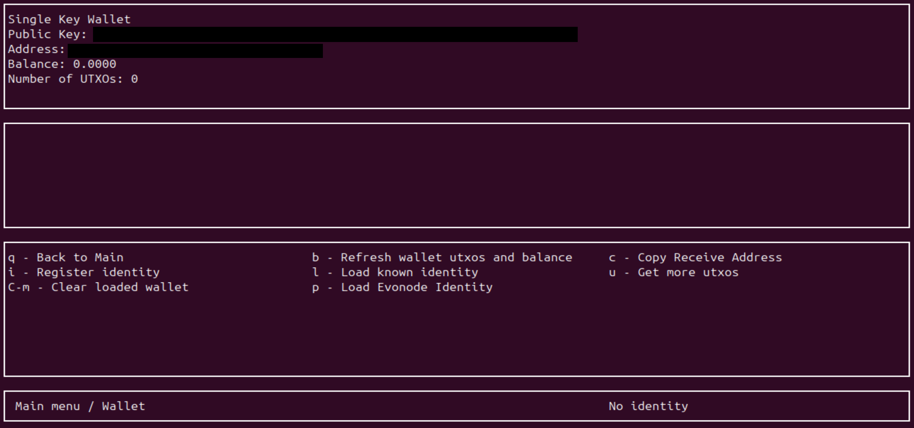

This screen also provides options for you to:

- Register identities
- Load previously registered identities
- Split the UTXOs currently in your wallet into a desired number of UTXOs with "Get more utxos". This is helpful for strategies that require many asset lock proofs.
- Load evonode identities (identities capable of [masternode voting](../../explanations/identity.md#voting))

## Platform information

This screen lets you see information on the epochs and the current version voting

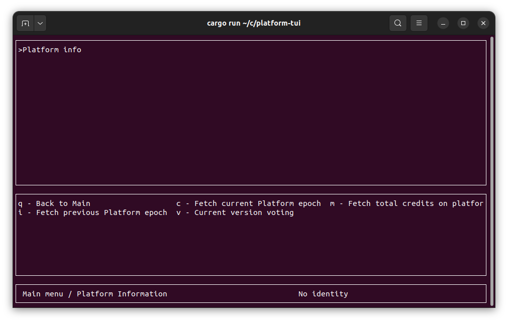

## Strategies

This screen is where you can add, select, import and export [strategies](https://www.dash.org/blog/strategy-tests-usage-guide/).

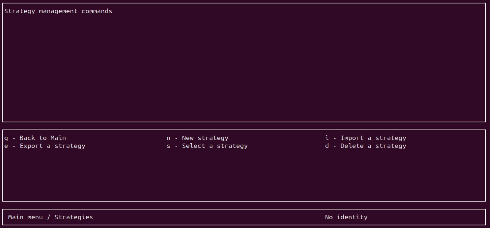

### Strategy management

If you select or create a strategy, you are taken to the following screen. Here you can manage the selected strategy.

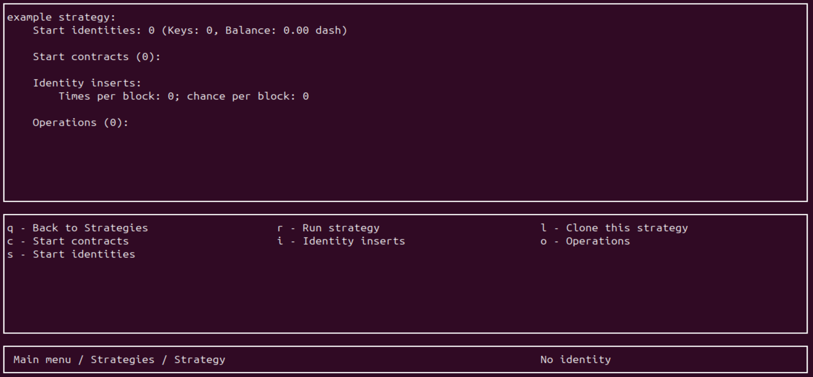

- "Start identities" is the number of identities present at the start of your strategy - it is recommended to have a sufficient number of identities. See the end of the [strategy guide](https://www.dash.org/blog/strategy-tests-usage-guide/) for suggestions
- "Start contract" is the number of contracts at the start of your strategy
- "Identitiy inserts" is the number of identities inserted per block during the runtime of the strategy
- "Operations" let you define the actions triggered during the runtime of the strategy

### Adding operations to a strategy

If you select "Operations", you will be presented with the following screen.

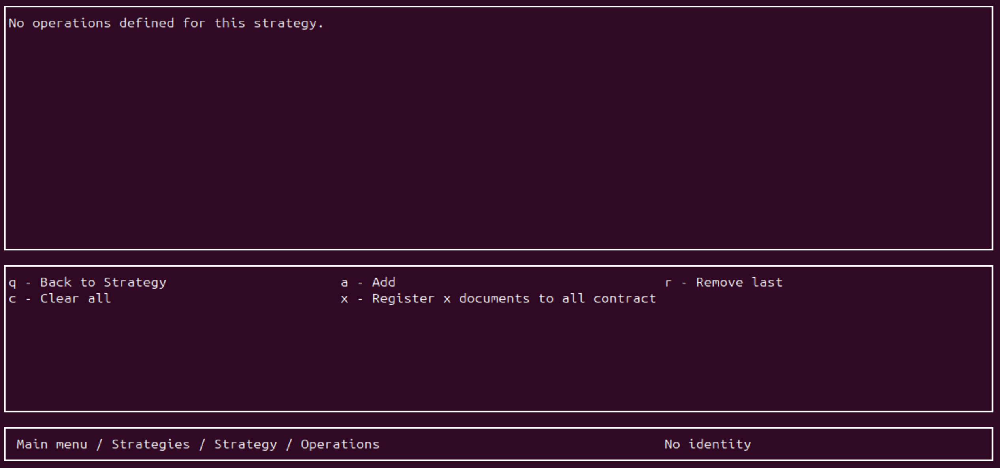

Remember that when adding a number of operations to the strategy, it is the number of operation *per block*. If the strategy runs for 12 blocks, and 5 operations are defined in the strategy, it will total to 5 operations each block for 12 blocks = 60 operations.

- "Add" lets you add specific documents, identity topups, key adds,... a specified number of time per block as shown in the [screenshot below](#add-strategy-operation)
- "Register x documents to all contracts" will register x document each block to every contract that has been created in the strategy so far. Adding 3 documents to 4 contracts will result to 12 documents being added per block. This includes both "start contracts" and contracts added by the "add" option.

#### Add strategy operation

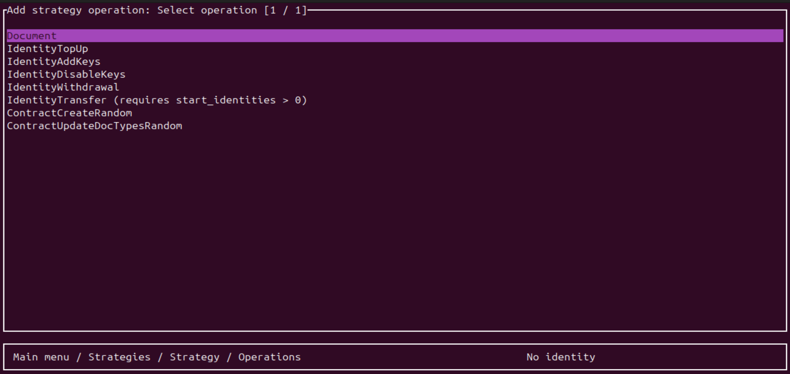

## Name voting

:::{tip}
Masternode and evonode owners that want to participate in voting should [load their masternode identity](#load-masternode-identity) before continuing.
:::

Since some names may be popular, the DPNS name registration process includes a voting mechanism to
resolve conflicts when multiple identities request the same name. Anyone can view the contested
resources screen and vote status; however, voting can only be done by masternodes and evonodes.

### DPNS Contested resources

The following sections describe how to [view](#viewing) and [vote](#voting) on contested resources.

#### Viewing

From the [DPNS main screen](#name-service-dpns), press `v` to open the voting screen.

The left side of the contested resources screen lists all names requiring votes. Scroll up or down
to select a name, then press `s` to see the current voting status.

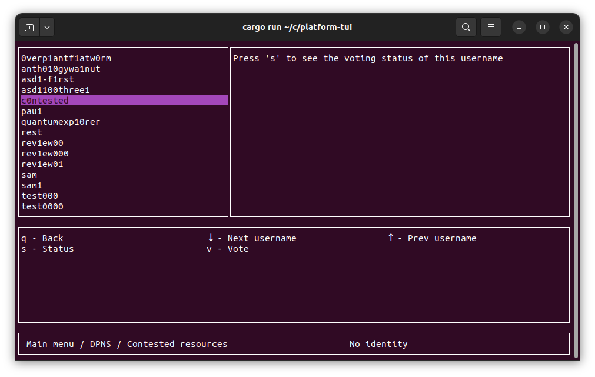

The vote status lists all identities currently requesting the name and the number of votes for each
one. Vote count for the abstain and lock categories are also shown.

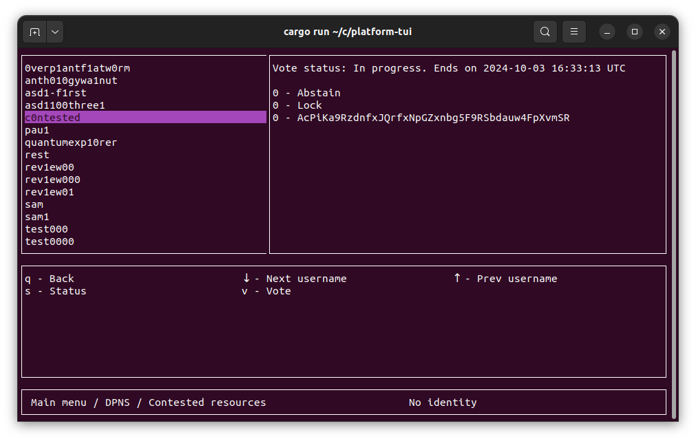

#### Voting

:::{attention}
Voting can only be done by masternodes and evonodes, and each node can only modify its vote four
times. See the [load masternode identity section](#load-masternode-identity) for instructions on
importing your masternode voting key to vote using the TUI.
:::

To vote on a contested resource, press `v` to open the voting screen, select your preferred option, and press `Enter` to submit your response.

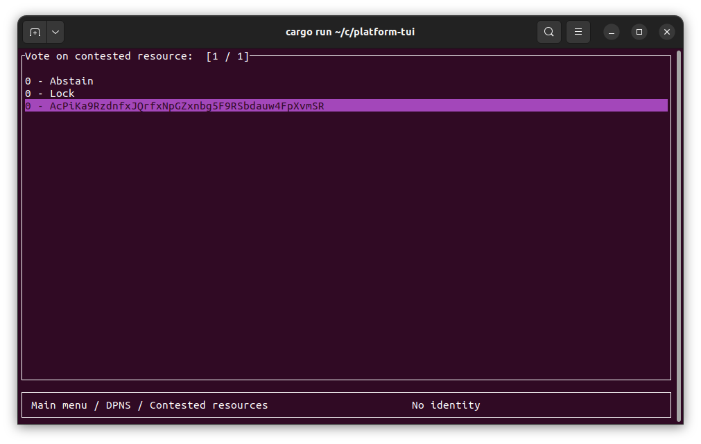

You will be returned to the contested resources screen and should see "Vote cast successfully".

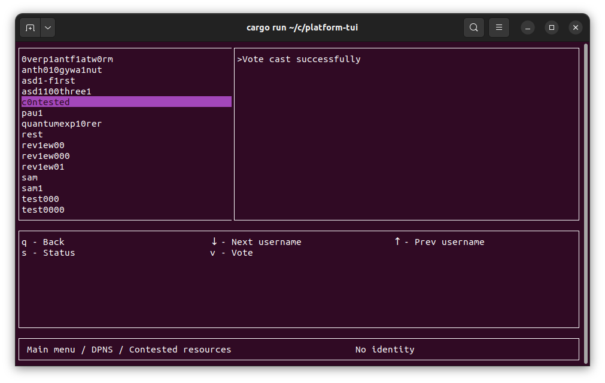

Check the status again to confirm that your vote was successful.

### Load masternode identity

:::{note}
A bug in the Platform TUI currently requires a wallet to be loaded before a masternode identity can
be loaded. Go to the [wallet screen](#wallet) and press `r` to create a random wallet if you have
not already created one.
:::

From the [Identities main screen](#identity-management), press `m` to load a masternode or evonode
identity. Paste the node's protx hash and press `Enter`.

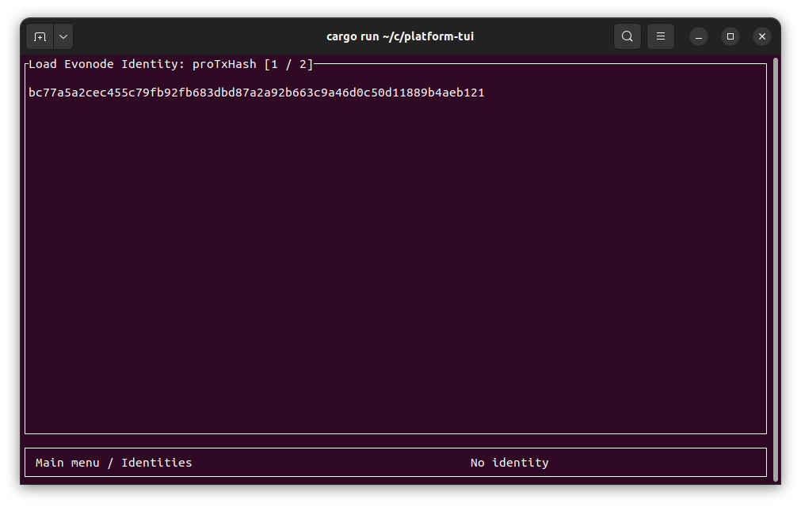

On the next screen, paste the node's voting private key and press `Enter`.

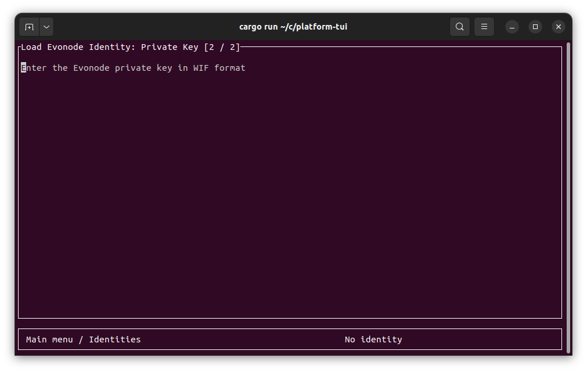

You will be returned to the Identities main screen and should see "Loaded Evonode Identity".

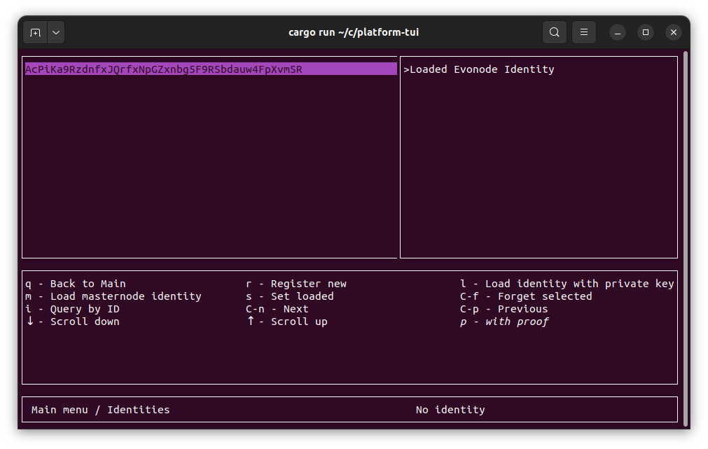

Refresh the screen to see the identity by pressing `q` to return to the main screen, and then reopen
the Identities screen by pressing `i`.

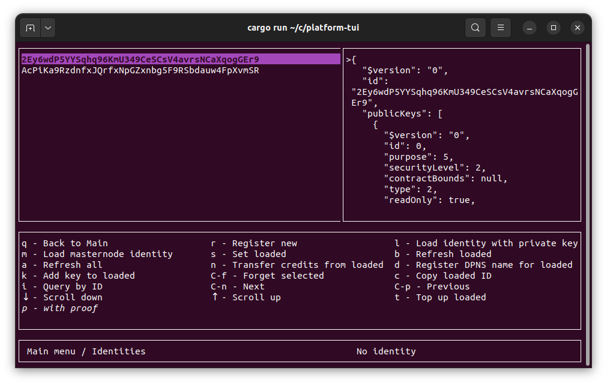